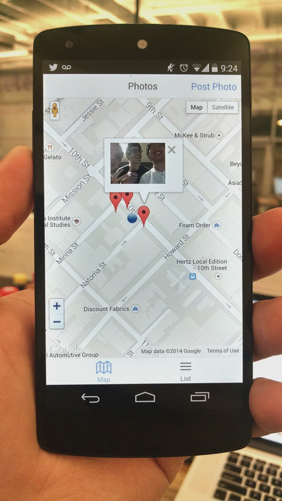

Hackstagram aka YAPSA (yet another photo sharing app)
=====================================================

> SoLoMo comes to Hacker School

This is a project built off the [Meteor Devshop Mobile Demo](https://github.com/meteor/mobile-packages/tree/master/examples/solomo).  We used it as an opportunity to start learning about how to make mobile apps with [Meteor](http://meteor.com/).

## Running the App

This is still a work in progress, but the current way to use the app on your phone is to sideload it.  You can find instructions [here](https://github.com/aguestuser/hackstagram/wiki#config).  You can also see the web version at [http://hackstagram.meteor.com/](http://hackstagram.meteor.com/).
